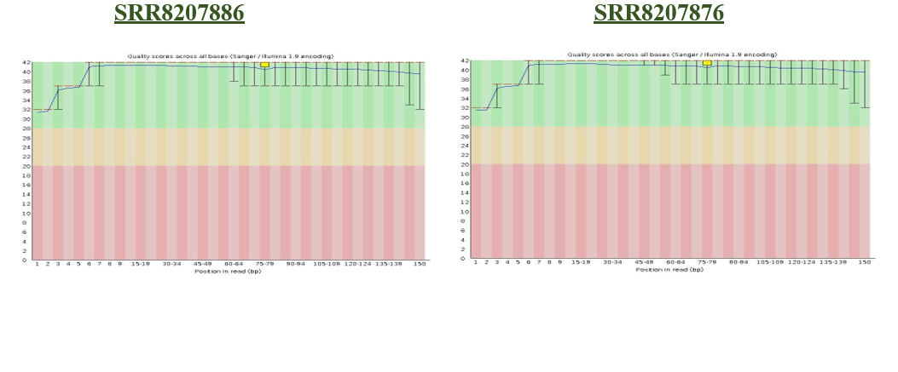
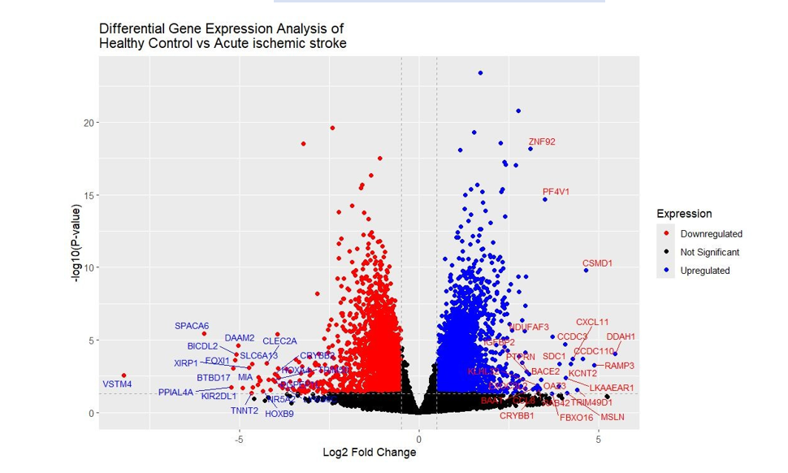

# RNAseq-Transcriptomics
## RNA-Seq Analysis Workflow

The RNA-seq dataset was analyzed using the following pipeline:

1. RNA-seq dataset retrieved from GEO (GSE122709)
2. Raw sequencing reads downloaded from SRA
3. Quality control performed using FastQC
4. Gene count matrix prepared for downstream analysis
5. Differential gene expression analysis performed using DESeq2 in R
6. PCA and volcano plots generated for visualization
7. Significantly upregulated and downregulated genes identified

## Results

### RNA-seq Quality Control

### Differential Expression

