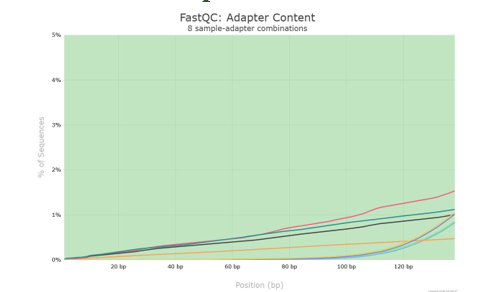
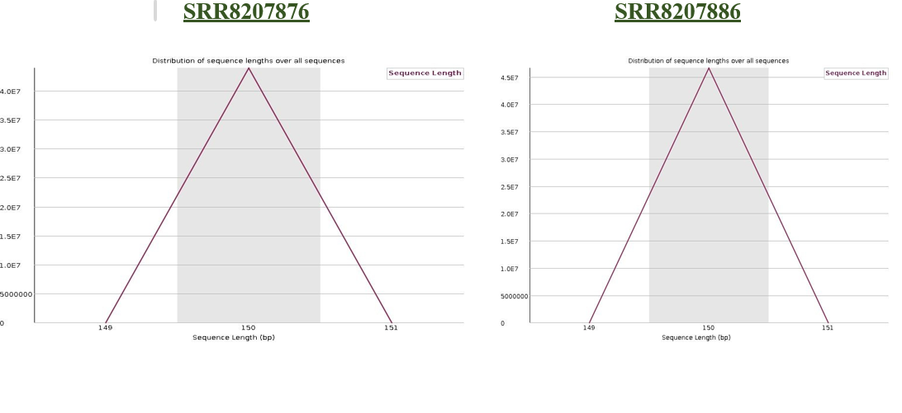
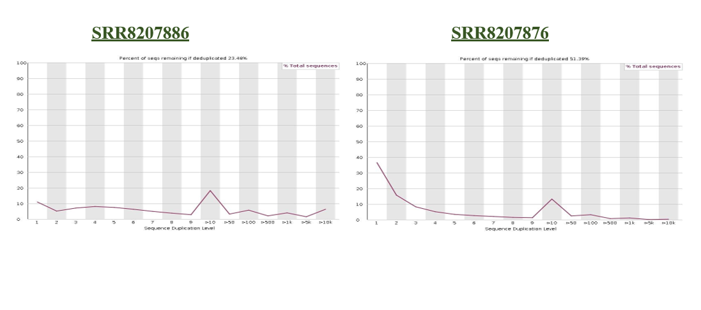
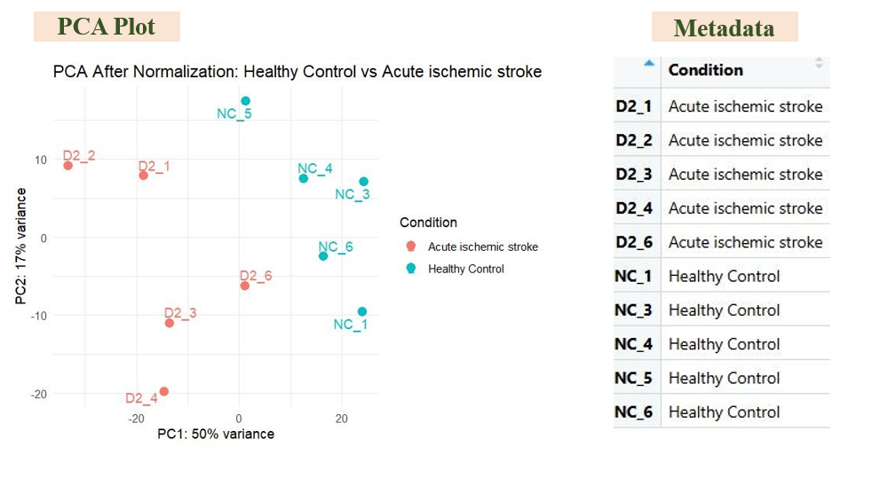
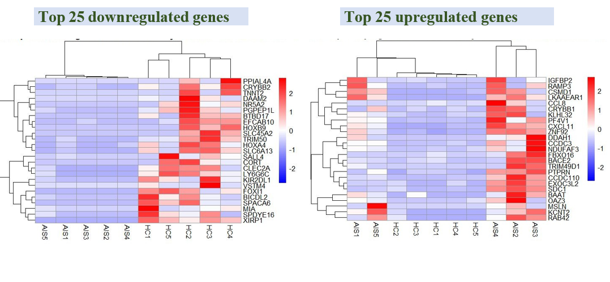
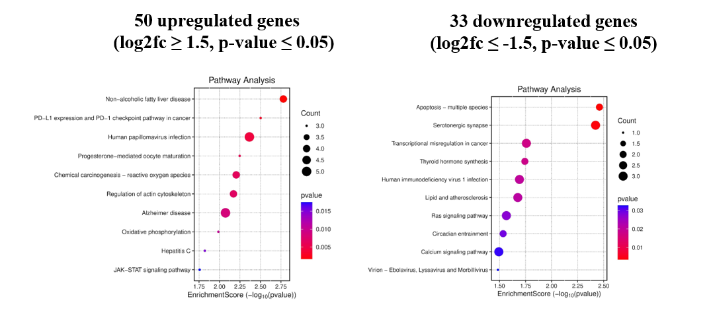

# RNA-seq Transcriptomic Analysis of Stroke Dataset

This project performs RNA-seq based transcriptomic analysis to identify differentially expressed genes associated with stroke. The analysis includes quality control of sequencing reads, differential gene expression analysis, and biological interpretation through pathway analysis.

The dataset was obtained from the GEO repository and analyzed using R-based bioinformatics tools.

## Objectives

* Perform quality assessment of RNA-seq reads
* Identify significantly differentially expressed genes
* Visualize expression patterns using PCA, volcano plots, and heatmaps
* Perform pathway enrichment analysis for biological interpretation

## Dataset Information

The RNA-seq dataset used in this study was obtained from the Gene Expression Omnibus (GEO) database.

Dataset accession: GSE122709

This dataset contains transcriptomic profiles from stroke patients and healthy control samples. The sequencing data was downloaded and used for downstream differential gene expression analysis.

Raw sequencing reads were retrieved from the Sequence Read Archive (SRA) associated with the GEO dataset.

## RNA-seq Analysis Workflow

The transcriptomic analysis was performed using the following workflow:

1. RNA-seq dataset retrieved from GEO
2. Raw sequencing reads downloaded from SRA
3. Quality control performed using FastQC
4. Gene expression data processed for downstream analysis
5. Differential gene expression analysis conducted using DESeq2
6. Visualization of results using PCA plots, volcano plots, and heatmaps
7. Pathway enrichment analysis performed to interpret biological significance

## Tools and Software Used

The RNA-seq transcriptomic analysis was performed using the following tools and software:

* R programming language
* Bioconductor packages for transcriptomic analysis
* DESeq2 for differential gene expression analysis
* FastQC for sequencing read quality control
* ggplot2 for data visualization
* GEO database for dataset retrieval


## Results


## RNA-seq Quality Control

Quality assessment of sequencing reads was performed using FastQC.

### Per Base Sequence Quality


### Adapter Content


### Sequence Length Distribution


### Sequence Duplication


## Differential Gene Expression Results

Differential expression analysis was performed to identify genes significantly altered between stroke patients and healthy controls.

### PCA Plot

Principal Component Analysis (PCA) showing clustering of stroke and control samples.



### Volcano Plot

Visualization of significantly upregulated and downregulated genes.


### Heatmap of Differentially Expressed Genes

Heatmap representing the expression patterns of top differentially expressed genes.



### Pathway Enrichment Analysis

Biological pathway enrichment analysis of significantly regulated genes.




## Project Structure

## Project Structure

```
RNAseq-Stroke-Transcriptomics
│
├── data
│   └── Dataset description and metadata
│
├── scripts
│   └── RNA-seq analysis scripts
│
├── results
│   ├── fastqc
│   │   └── Quality control reports
│   │
│   └── differential_expression
│       └── PCA, volcano plots, heatmaps, pathway analysis
│
└── README.md
```

